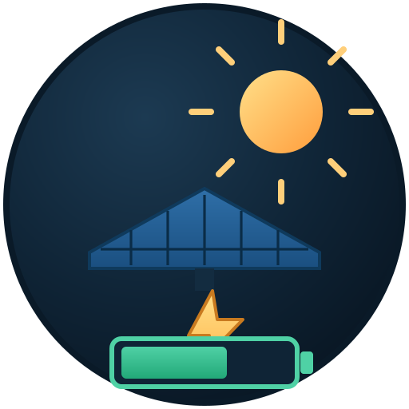

<!-- IF YOU EDIT THIS FILE, also update README.de.md -->
<p align="center"><a href="README.de.md">Deutsch</a> · English</p>

<p align="center"></p>

# PV Excess Control — dmacwalter fork

**A comprehensive Home Assistant integration for intelligent solar excess power optimization and cheap grid tariff management.**

[](https://github.com/hacs/integration)
[](https://www.home-assistant.io)
[](https://www.gnu.org/licenses/agpl-3.0)
[](https://github.com/sponsors/InventoCasa)
[](https://buymeacoffee.com/henrikic)

---

## Upstream project & credit

**This is a fork. Essentially all of this integration is the work of
[Henrik Wasserfuhr](https://github.com/InventoCasa), founder of
[InventoCasa](https://inventocasa.de)** — the architecture, the planner, the
optimizer, the tariff and forecast providers, the config flow, the dashboards,
the documentation, and the test suite are all his. The upstream project lives at:

→ **https://github.com/InventoCasa/PV-Excess-Control**

Henrik also wrote the original pyscript + blueprint
[PV / Solar Excess Optimizer](https://community.home-assistant.io/t/pv-solar-excess-optimizer-auto-control-appliances-wallbox-dish-washer-heatpump-based-on-excess-solar-power/552677)
that this integration succeeds, and released the whole thing open source
while using it in his own professional installations.

If this integration is useful to you, please support **him**, not this fork:
[sponsor Henrik on GitHub](https://github.com/sponsors/InventoCasa) or
[buy him a coffee ☕](https://buymeacoffee.com/henrikic). If you want a complete
smart home designed, configured and commissioned end to end, InventoCasa takes
on a limited number of custom projects each year —
[inventocasa.de](https://inventocasa.de).

**What this fork is:** a small set of battery-SoC-aware safety gates and
external-controller integration options added on top of Henrik's engine, driven
by one specific real-world setup (GoodWe hybrid inverter + battery, evcc-managed
EV charger, pool heat pump, Australian demand-tariff). Everything here is
additive and opt-in — with all new options left at their defaults, behaviour is
identical to upstream. These changes are offered back upstream; if they land
there, this fork becomes redundant, which is the intended outcome.

**Should you use this fork?** Probably not, unless you specifically need one of
the additions in [Fork additions](#fork-additions) below. Use
[upstream](https://github.com/InventoCasa/PV-Excess-Control) by default — it is
the maintained project with the wider user base and the real test coverage.

See [CHANGELOG.md](CHANGELOG.md) for the full technical detail on every change.

---

## Fork additions

Everything in this section is **new in this fork** and defaults to off/empty.

### Battery target gate (`battery_target_gated`)

A per-appliance toggle — *"Block Fast-Charge Preemption Once Battery Full"* — for
switches that **command an inverter to charge** (e.g. a GoodWe "fast charge"
switch) rather than being wattage-limited to actual solar excess.

The real-time PREEMPT phase is a pure power-budget feasibility check. If shedding
a lower-priority appliance frees enough PV budget *on paper*, PREEMPT will switch
the higher-priority appliance on. That is correct for a normal load that draws
only what the surplus supports — but a fast-charge switch isn't wattage-limited;
it tells the inverter to charge, and the inverter pulls whatever it needs,
including from the grid.

Observed in production: pool heater shed at 14:40 → fast-charge switch on at
14:41 → battery already at 98 % SoC and climbing on solar alone → grid import
into an effectively full battery.

With this flag enabled, the appliance is excluded from PREEMPT and from all
grid-supplement paths once the battery has reached the plan's target SoC.

### Externally-managed load add-back

Three optional fields on the **Sensor Mapping** page, for when a large load is
controlled by **another** system (evcc, an OEM wallbox app) rather than by this
integration.

Such a load still shows up in the grid meter, so the surplus looks like it
vanished and this integration backs its own appliances off — the external
controller takes everything. If both systems are surplus-following, they fight
over the same watts.

| Field | Purpose |
|---|---|
| **Externally-Managed Load Power Sensor** | That load's live power. When set, its draw is added back onto the computed excess, so this integration sees the surplus that *would* exist if the external load weren't drawing. Its appliances allocate first; the external controller takes what's left (evcc does this via `residualPower` / aux meters). |
| **External Load Priority Mode Entity** | Entity from the external controller reporting its current mode (for evcc, the charge-mode select). |
| **Priority Mode State Value** | The state meaning "priority mode active" — `now` for evcc's Fast Charge. While matched, the add-back is skipped. |

**This is a genuine either/or, and both answers are valid:**

- **Set the sensor** → *your* appliances (pool, hot water) get priority over the
  external load.
- **Leave it empty** → the external load gets priority, and this integration
  works with whatever surplus is actually left. This is upstream behaviour and
  remains the default.

The priority-mode fields let you temporarily reverse whichever way you chose, so
an explicit "charge now" request from the user is honoured: this integration
sees the genuinely reduced surplus and sheds its own appliances out of the way,
instead of protecting them against a charge that was deliberately asked for.

Units are read from each sensor's own `unit_of_measurement` (W / kW / MW all
work). State matching is case- and whitespace-insensitive.

### Other additions

- **`shed_before_grid_charge`** — always shed a flagged appliance before forced
  grid charge engages, regardless of `min_daily_runtime`, with a one-cycle
  deferral so freed power registers in `battery_power` first.
- **Grid-charge false-positive fix** — stops battery power being credited as
  "excess" while the battery is being charged *from the grid*.
- **Deadline-aware shed protection** — appliances with a `schedule_deadline` are
  judged against their own averaged excess until the deadline passes, so a brief
  instantaneous dip doesn't shed something that had time to ride it out.
- **Post-deadline battery lock** — past both the appliance deadline and the
  battery target time, the appliance is blocked unless the battery met its
  target (stops the pool draining the battery during peak tariff).
- **Cheap-window target current UI fix** — the field no longer pre-fills with
  `max_current`, which made every appliance look deliberately configured for
  max-current grid draw when it had never been touched.

---

## Features

*(All of the below is upstream InventoCasa functionality.)*

### Core Optimization & Planning
- **Smart Planning** - 24-hour forward-looking optimizer with weather-aware pre-planning and configurable plan influence.
- **Priority-Based Appliance Control** - Manage multiple appliances with configurable priorities (1-1000).
- **Opportunity Cost** - Factors in feed-in tariff revenue when making decisions.
- **Appliance Dependencies** - Chain appliances so one only runs when another is active.
- **Per-Appliance Averaging Window** - Custom smoothing period per appliance for excess power calculations.
- **Min/Max Runtime & Time Windows** - Ensure appliances run for required durations and restrict them to specific hours.

### EV & Battery Management
- **EV SoC-Aware Charging** - Considers EV battery level, connection status, and user-defined targets.
- **Schedule Deadlines** - Set constraints like "EV must be charged by 7am".
- **Dynamic Current Control** - Variable amperage for EV chargers and wallboxes (6-32 A).
- **Battery-Aware Optimization** - Three strategies: Battery First, Appliance First, Balanced.
- **Minimum Battery SoC Protection** - Shed appliances when battery level drops below a configured threshold.
- **Battery Discharge Protection** - Limit discharge rate when big consumers are running.

### Tariffs & Grid
- **Tariff Integration** - Support for Tibber, Awattar, Nordpool, Octopus Energy, and generic price sensors.
- **Export Limit Management** - Absorb would-be-curtailed power when feed-in caps apply.
- **Grid Supplementation** - Allow a small amount of grid power to top up appliances.

### UI, Analytics & Integrations
- **Solar Forecast Integration** - Solcast, Forecast.Solar, and generic forecast sensors.
- **Extensive Dashboard Examples** — Build your own dashboard with Mushroom, ApexCharts and other community cards. [Full YAML examples included](docs/dashboard-examples.md).
- **Self-Consumption Analytics** - Track savings, self-consumption ratio, energy statistics.
- **Manual Override** - Force appliances on/off from the dashboard.
- **Configurable Notifications** - Per-event toggles for appliance changes, daily summaries, warnings.

## Requirements

- Home Assistant 2025.8 or newer
- A solar inverter with power sensors exposed to Home Assistant
- [HACS](https://hacs.xyz/) for the recommended installation method

## Installation

> **Installing upstream instead?** Use
> `https://github.com/InventoCasa/PV-Excess-Control` — recommended for most
> users.

### HACS

1. Open HACS in your Home Assistant sidebar
2. Click the three-dot menu and select **Custom repositories**
3. Add `https://github.com/dmacwalter/PV-Excess-Control` as an **Integration**
4. Search for "PV Excess Control" and click **Download**
5. Restart Home Assistant
6. Go to **Settings → Devices & Services → Add Integration** and search for **PV Excess Control**

### Manual

1. Download or clone this repository
2. Copy the `custom_components/pv_excess_control` folder into your `config/custom_components/` directory
3. Restart Home Assistant
4. Go to **Settings → Devices & Services → Add Integration** and search for **PV Excess Control**

## Quick Start

1. **Add the integration** - Settings → Devices & Services → Add Integration → PV Excess Control
2. **Configure your inverter** - Select Standard or Hybrid, then map your power sensors
3. **Configure energy pricing** - Select your tariff provider or leave it as None
4. **Add appliances** - Use the integration's sub-device UI to add each appliance
5. **Set up your dashboard** — See the [Dashboard Examples](docs/dashboard-examples.md) for ready-to-use YAML configurations using popular community cards.

See the [full documentation](docs/) for detailed setup guides.

## Documentation

- [Installation Guide](docs/installation.md)
- [Configuration](docs/configuration/)
  - [Initial Setup](docs/configuration/initial-setup.md)
  - [Sensor Mapping](docs/configuration/sensor-mapping.md)
  - [Adding Appliances](docs/configuration/adding-appliances.md)
  - [Energy Pricing](docs/configuration/energy-pricing.md)
  - [Solar Forecast](docs/configuration/solar-forecast.md)
  - [Multi-Inverter Setup](docs/configuration/multi-inverter.md)
- [Features](docs/features/)
  - [Battery Management](docs/features/battery-management.md)
  - [Dynamic Current Control](docs/features/dynamic-current.md)
  - [EV Charging](docs/features/ev-charging.md)
  - [Tariff Optimization](docs/features/tariff-optimization.md)
  - [Export Limiting](docs/features/export-limiting.md)
  - [Weather Pre-Planning](docs/features/weather-preplanning.md)
  - [Notifications](docs/features/notifications.md)
  - [Analytics](docs/features/analytics.md)
- [Dashboard](docs/dashboard/)
  - [Dashboard Examples](docs/dashboard-examples.md)
  - [Entity Reference](docs/dashboard/custom-dashboards.md)
- [Advanced](docs/advanced/)
  - [How It Works](docs/advanced/how-it-works.md)
  - [Priority Guide](docs/advanced/priority-guide.md)
  - [Troubleshooting](docs/advanced/troubleshooting.md)
  - [Automation Examples](docs/advanced/automation-examples.md)
- [Migration from Blueprint](docs/migration.md)
- **[Fork changes vs. upstream](CHANGELOG.md)**

## Architecture

The integration uses a hybrid real-time + planning approach:

- **Real-time Controller** (every 30 s) - Reads live sensor data, applies optimizer decisions
- **Forward-Looking Planner** (every 15 min) - Creates optimal 24-hour schedules using forecast and tariff data
- **Pure-Logic Optimizer** - Zero HA dependencies, fully unit-testable decision engine

## Support this project

Support goes to the upstream author, Henrik Wasserfuhr — this fork asks for
nothing. If PV Excess Control brings measurable value to your home, consider
[sponsoring him on GitHub](https://github.com/sponsors/InventoCasa) or
[buying him a coffee ☕](https://buymeacoffee.com/henrikic). Every contribution
helps keep the code open and actively maintained.

## Contributing

Contributions to the **upstream** project are best opened at
[InventoCasa/PV-Excess-Control](https://github.com/InventoCasa/PV-Excess-Control).
For issues specific to the additions in this fork, open an issue here.

```bash
pip install -r requirements_test.txt
python3 -m pytest tests/ --ignore=tests/playwright --ignore=tests/ha_integration_test.py
```

## License

This project is licensed under the **GNU Affero General Public License v3.0 (AGPL-3.0)** - see the [LICENSE](LICENSE) file for details. This fork is redistributed under the same license as the upstream project.

**What this means:**
- **Personal use** - fully free, no restrictions
- **Commercial use** - if you integrate this into a product or service, you must open-source your entire work under AGPL-3.0
- **Commercial licensing** - for proprietary/commercial use without the AGPL obligations, [contact InventoCasa](https://inventocasa.de/kontakt/) for a commercial license
